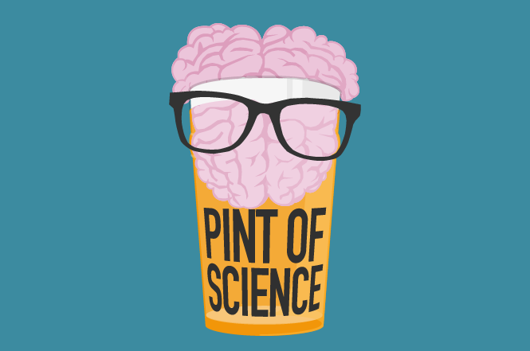
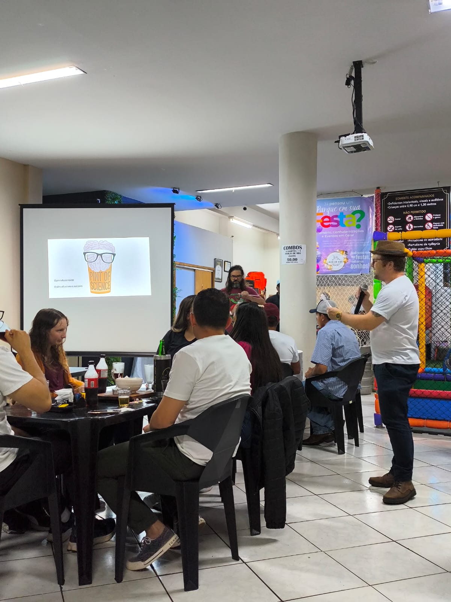

# 🧪 Piteofscience (Pint of Science)

<p align="center">
  
</p>

> Site desenvolvido como atividade acadêmica para o curso de **Sistemas de Informação (IFPR)**, inspirado no evento de divulgação científica realizado em ambiente descontraído.

---

## 📝 Sobre o Projeto
O projeto nasceu da experiência de participar de palestras científicas realizadas em uma lanchonete local. O objetivo do site foi criar um portal para registrar e divulgar as palestras assistidas, unindo o aprendizado acadêmico com a vivência do evento.

### 🛠️ Tecnologias Utilizadas


---

## 📸 Registro do Evento
<p align="center">
  
</p>

## 📌 Funcionalidades
* Apresentação dos temas discutidos nas palestras.
* Galeria de informações sobre os palestrantes.
* Layout focado na experiência do usuário e na clareza das informações científicas.

---

## 🚀 Como rodar o projeto
1. Clone o repositório:
   ```bash
   git clone [https://github.com/Gu1bas/Piteofscience.git](https://github.com/Gu1bas/Piteofscience.git)
